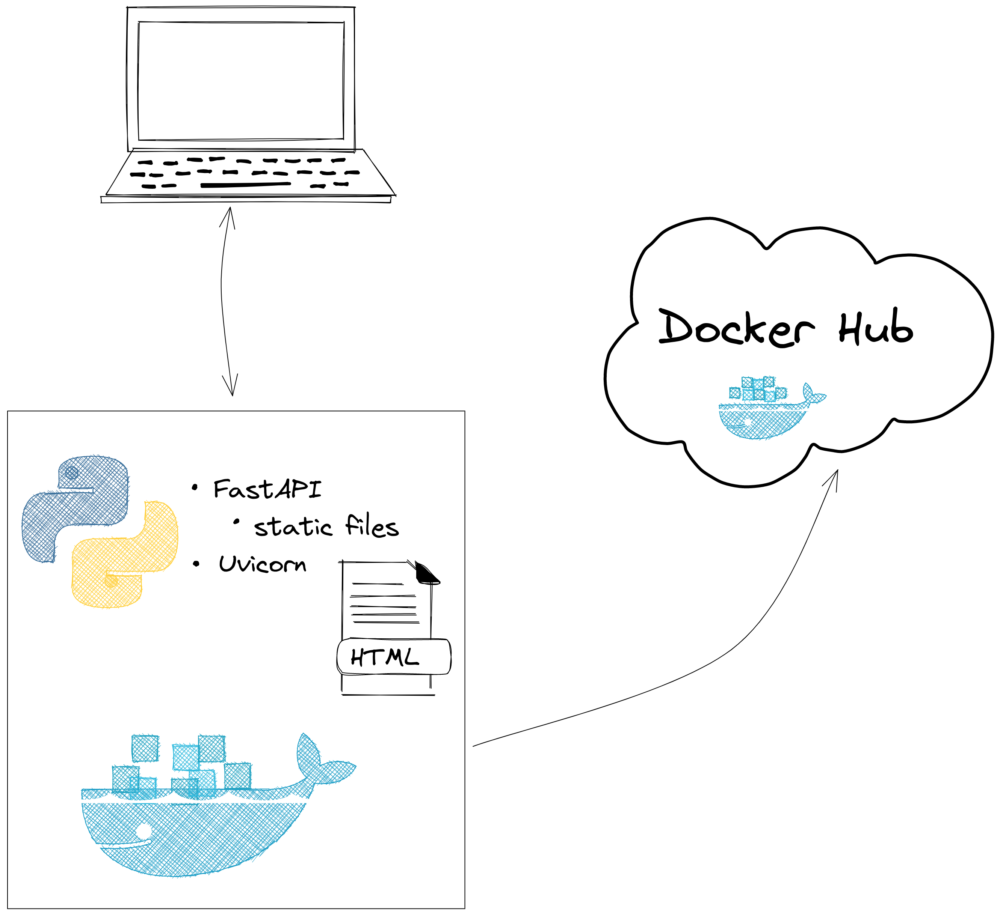
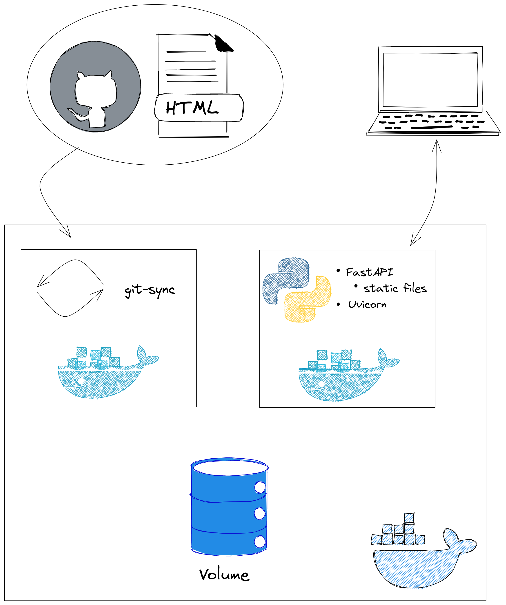
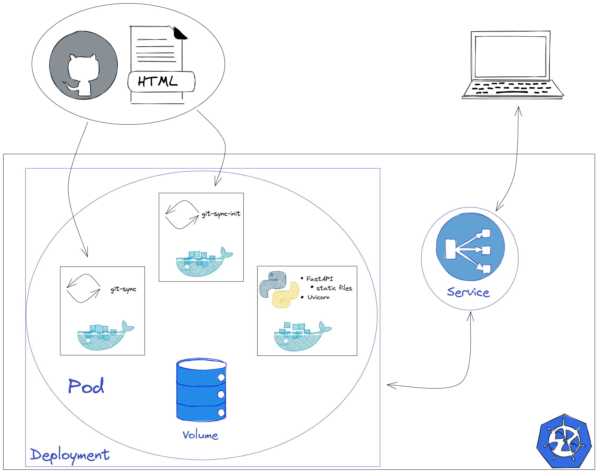

# Microsserviços no Kubernetes

### 1. Criando a Aplicação

    

#### Links úteis
- https://fastapi.tiangolo.com/
- https://www.uvicorn.org/
- https://www.html5webtemplates.co.uk/templates/
- https://www.docker.com/
- https://hub.docker.com/
 
 ### 2. Sincronizando o conteúdo remotamente

    

#### Links úteis
- https://github.com/kubernetes/git-sync/tree/v3.6.0

### 3. Escalando a Aplicação no Kubernetes

    

#### Links úteis
- https://kubernetes.io/
- https://kubernetes.io/docs/concepts/workloads/pods/#how-pods-manage-multiple-containers